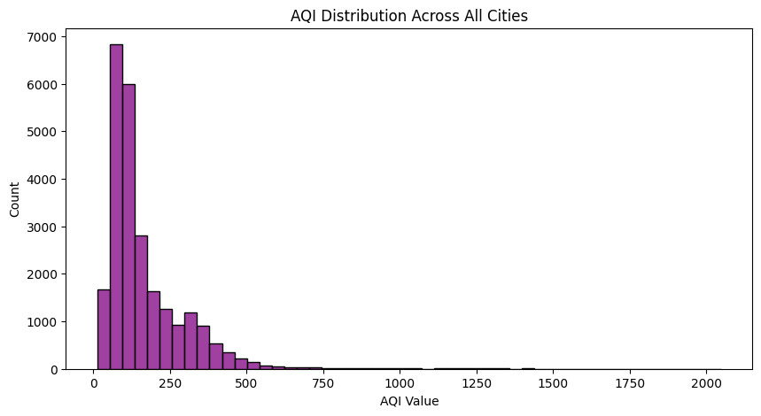
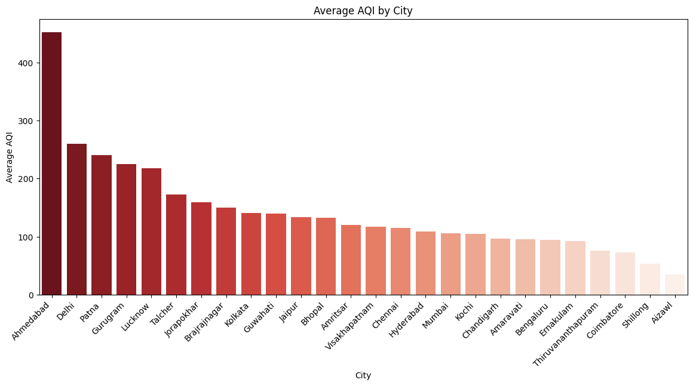
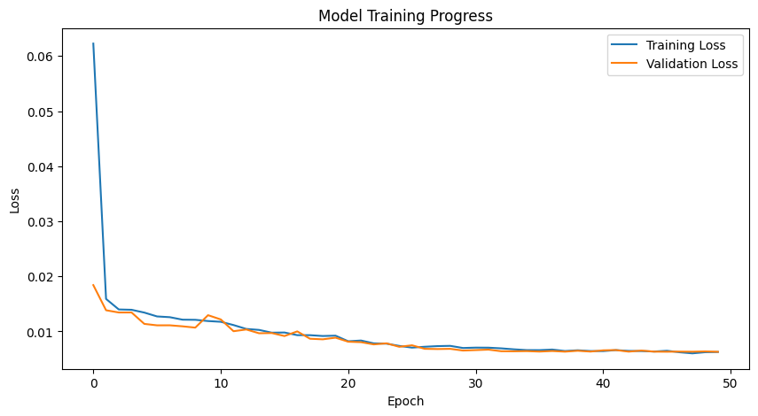
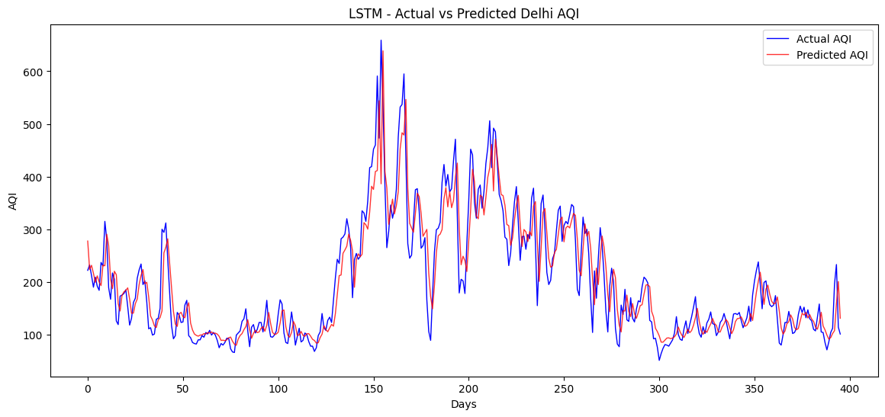
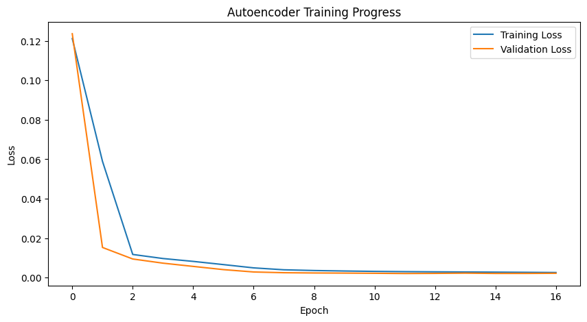
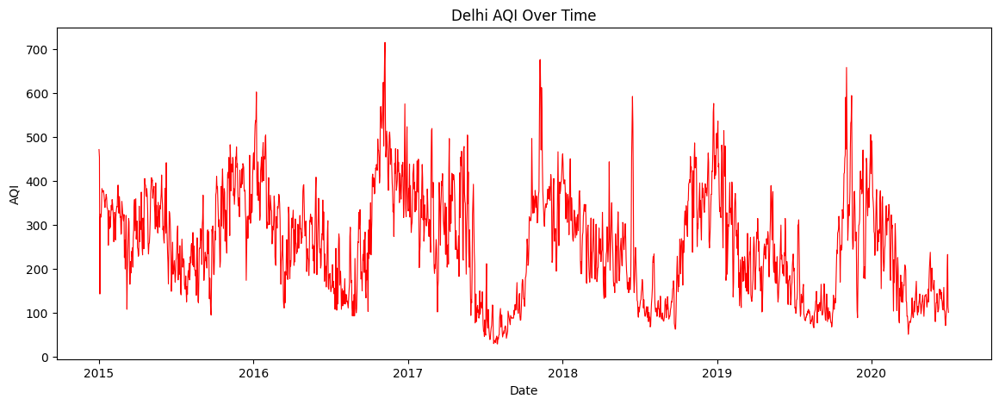

# 🌬️ Intelligent Air Quality Monitoring System

An end-to-end AI/ML system that predicts, forecasts, and detects anomalies in 
Indian city air quality data using multiple machine learning models.

## 🚀 Live Demo
[Click here to view the live app](#) ← (we'll add this link after deployment)

## 📌 Project Overview
This project builds a complete intelligent air quality monitoring pipeline using 
real Indian city AQI data from 2015-2020. It combines multiple ML models to 
predict AQI, forecast future trends, and automatically detect dangerous pollution events.

## 🤖 Models Built

| Model | Type | Purpose | Result |
|---|---|---|---|
| Random Forest | Scikit-learn | Predict current AQI | 88.6% accuracy |
| LSTM | TensorFlow/Keras | Forecast future AQI | MAE 33 pts |
| Isolation Forest | Scikit-learn | Detect pollution spikes | 101 anomalies found |
| Autoencoder | TensorFlow/Keras | Validate anomalies | 101 anomalies confirmed |

## 📊 Key Findings
- PM2.5 and CO together account for 81% of AQI prediction
- 101 anomalous pollution days detected in Delhi (2015-2020)
- 8 out of top 10 most dangerous days were in November (Diwali + crop burning)
- Both Isolation Forest and Autoencoder independently confirmed the same anomalies
- Delhi AQI reached a maximum of 716 — hazardous level

## 🛠️ Tech Stack
- **Python** — core language
- **Pandas & NumPy** — data cleaning and manipulation
- **Matplotlib & Seaborn** — data visualization
- **Scikit-learn** — Random Forest, Isolation Forest
- **TensorFlow/Keras** — LSTM, Autoencoder
- **Streamlit** — live web application

## 📁 Project Structure

## 📈 Results

### AQI Distribution

### Average AQI by City

### Feature Importance

### LSTM Predictions

### Anomaly Detection

### Autoencoder Anomaly Detection

### Delhi AQI Over Time

## 🔍 Dataset
- **Source:** [Air Quality Data in India — Kaggle](https://www.kaggle.com/datasets/rohanrao/air-quality-data-in-india)
- **Cities:** 26 Indian cities
- **Period:** 2015 - 2020
- **Records:** 29,531 daily readings

## 👨‍💻 Author
**Your Name**
- GitHub: your github link
- LinkedIn: your linkedin link
